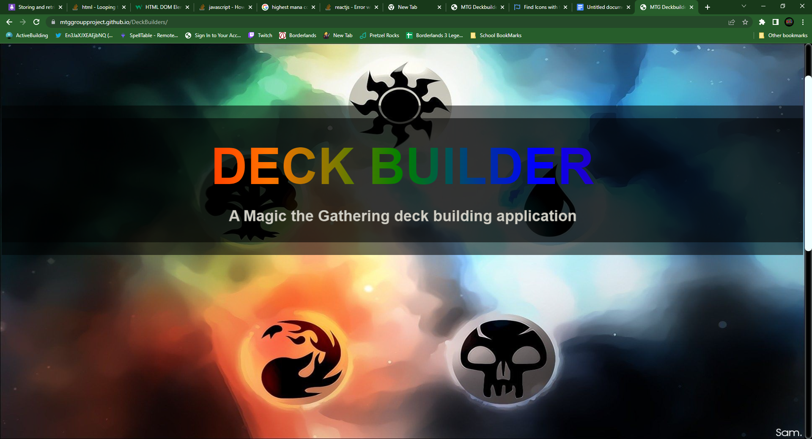

# DeckBuilders
## Link to App
[DeckBuilder](https://mtggroupproject.github.io/DeckBuilders/)
## About this app
This app helps new and old players of magic the gathering to make new decks digitally and see their deck broken down in several ways. The motivation of this project is to help the magic the gathering community to have an easier way to view the content of their deck. This app will make it so the user can either make a new deck or take an existing deck and view some key information about it. This app will solve problems such as having to spread a deck out on a table or floor and having to do all the breakdown in your head. This app also solves when building a new deck the user can look at what it will look like before actually building it.

## Code Usage 
* srcyfall api 
* google maps api 
* javascript 
* css 
* foundation

## Installation

The user can first name a deck to store cards inside that decks name. Then the user can either search by card name or search by other key factors to help narrow down a card they are looking for. Then once the user finds the card they are looking for they then can add that card to the whatever deck list they have named. After the user has completed there deck they then can go to the deck break down section and see there deck broken down in 3 main factors. Those factors are Mana Curve which shows how much of each color of card the user has in there deck. The next factor is total converted mana cost or cmc for short. Then the user can view their deck split by permanents, lands and instant / sorcery.

## Usage

 

## Credits
* James Ioriatti [https://github.com/JIoriatti]

* Maggie Matson [https://github.com/mmmatson]

* Matt Fischer [https://github.com/MfischerTurtle]

## Future development 
* show image of cards on hover in card search
* show images of cards on hover in card breakdown
* driving direction for nearest store search
* drag and drop function for adding cards to deck
* playtest section to test deck
* play with deck against other people on app
* more in depth search parameters
* more in depth breakdown of card types

